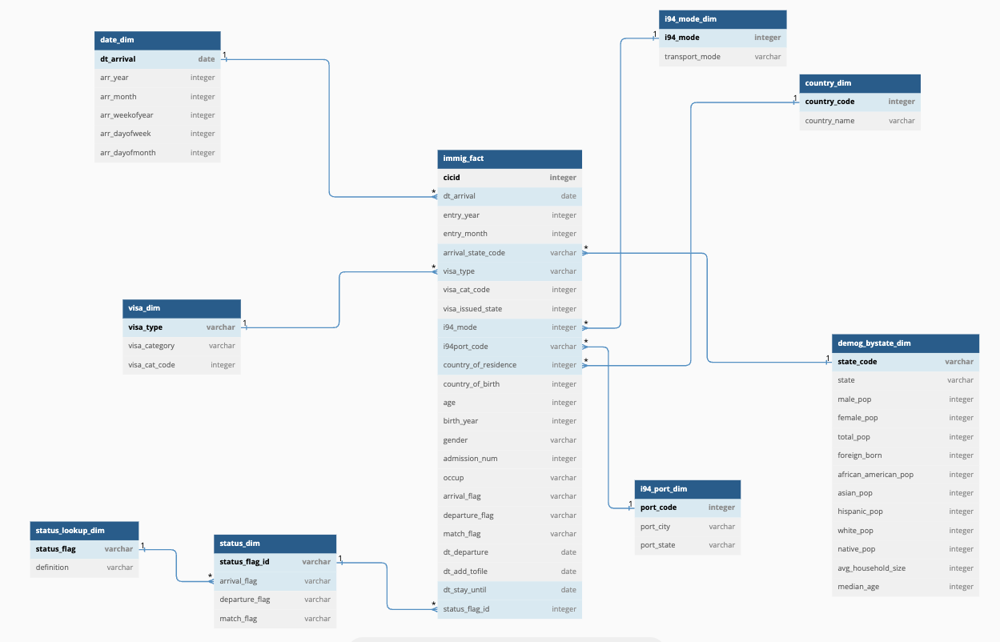

# U.S. Immigration Data ETL Pipeline

## Overview

This project demonstrates the development of a scalable ETL pipeline designed to process and analyze U.S. immigration data. The pipeline is engineered to extract, transform, and load (ETL) over 1 million records efficiently, leveraging Apache Spark, Amazon S3, and Apache Airflow. The data model created provides insights into immigration trends, supporting comprehensive analysis.

## Table of Contents

- [Architecture](#architecture)
- [Data Model](#data-model)
- [Technologies Used](#technologies-used)
- [Setup Instructions](#setup-instructions)
- [Data Quality and Testing](#data-quality-and-testing)
- [Scalability Considerations](#scalability-considerations)
- [Future Enhancements](#future-enhancements)

## Architecture

The ETL pipeline is designed with scalability and efficiency in mind. Below is a high-level overview of the key components.

### Key Components:
- **Data Sources**: Raw data includes immigration records, demographic data, port codes, and country codes.
- **Apache Spark**: Used for processing and transforming large datasets.
- **Amazon S3**: Storage solution for both raw and transformed data.
- **Apache Airflow**: Manages ETL workflows and automations.
- **Data Warehouse**: Data is modeled into a star schema for easy querying.

## Datasets Used

This project utilizes multiple datasets to build a comprehensive view of U.S. immigration patterns. Below are the details of the datasets:

1. **i94 Immigration Data (i94_apr16_sub.sas7bdat)**:
   - **Source**: U.S. National Tourism and Trade Office
   - **Description**: Contains records of international visitors to the U.S., including visa types, travel modes, and arrival dates. This dataset serves as the fact table in the star schema.
   - **File Size**: Over 1 million records.
   - **Usage**: Used to create the fact table (`immigration_fact`) and support immigration trend analysis based on country, visa, and date.

2. **U.S. City Demographics (us-cities-demographics.csv)**:
   - **Source**: Open Data from U.S. Census Bureau
   - **Description**: Contains demographics information such as population, median age, and racial breakdown across various U.S. cities.
   - **File Size**: 43 fields across multiple cities and states.
   - **Usage**: Provides demographic information to create the dimension table (`demog_bystate_dim`).

3. **Airport Codes (port_data.csv)**:
   - **Source**: Open Data
   - **Description**: A dataset mapping airport codes to city names and state codes. It includes information on the various entry ports used by immigrants.
   - **File Size**: 1000+ entries for U.S. ports.
   - **Usage**: Helps create the dimension table (`i94_port_dim`) to link immigration records to specific entry ports.

4. **Country Codes (country_codes.csv)**:
   - **Source**: Provided by U.S. Immigration datasets
   - **Description**: Contains mapping of country codes to country names, enabling the identification of immigrants' origin.
   - **File Size**: Covers hundreds of countries.
   - **Usage**: Used to populate the `country_dim` table, providing insights into immigration patterns by country.

5. **Global Land Temperature Data (temperature_data.csv)** (Optional Enrichment):
   - **Source**: Kaggle Dataset from Berkeley Earth
   - **Description**: Includes temperature information for cities globally, which can be used for advanced analyses to correlate climate conditions with immigration patterns.
   - **File Size**: Over 8 million records.
   - **Usage**: Enrich the analysis by providing contextual information about the climate in the cities of origin and destination.

Each dataset is loaded, cleaned, and transformed using Apache Spark and stored in Amazon S3 before being integrated into the final data model for analysis.

## Data Model

The project utilizes a star schema data model, designed to facilitate analysis of immigration trends based on various dimensions such as visa type, demographic information, and entry ports.

### Data Model Details:
- **Fact Table**: `immigration_fact` stores the main records of immigration data.
- **Dimension Tables**:
  - `visa_dim` – Details on visa categories.
  - `i94_mode_dim` – Transportation modes used by immigrants.
  - `status_dim` – Immigration status information.
  - `demog_bystate_dim` – Demographic data aggregated by state.
  - `country_dim` – Country-specific information.
  - `i94_port_dim` – Information on entry ports.
  - `date_dim` – Calendar dates for temporal analysis.

## Technologies Used

- **Apache Spark**: For data processing and transformation.
- **Amazon S3**: Cloud storage for raw and processed data.
- **Apache Airflow**: Workflow orchestration and automation.
- **Python**: Programming language used for scripting.
- **Amazon Redshift**: (Proposed) for scalability when handling larger datasets.

## Data Quality and Testing

To ensure data integrity, the following checks are implemented:
- **Unique Constraints**: Applied to ensure no duplicate records.
- **Data Type Verification**: Ensuring data consistency across tables.
- **Row Count Checks**: Verifying completeness of data post-transformation.

## Scalability Considerations

To ensure the pipeline scales efficiently for larger data volumes and increased user demand, the following strategies can be considered:

- **Increased Data Volume:**  
  Migrate to Amazon Redshift for scalable data warehousing and utilize Amazon EMR for distributed processing to handle significantly larger datasets.

- **High User Access:**  
  Implement Redshift’s concurrency scaling or use Amazon Athena to manage simultaneous queries from 100+ users without performance bottlenecks.

- **Automated Daily ETL Runs:**  
  Optimize Apache Airflow DAGs for parallel task execution and integrate Apache Kafka for real-time data ingestion, ensuring data is processed and available by daily deadlines.

- **Cost Efficiency:**  
  Use Amazon S3 Intelligent-Tiering for cost-effective storage of infrequently accessed data, and leverage Spot Instances on EMR to minimize processing costs for large datasets.

- **Optimized Query Performance:**  
  Apply partitioning and indexing on key fields in Amazon Redshift to improve query performance and ensure scalability as data grows.

## Future Enhancements

- **Dashboard Integration**: Implementing Power BI for dynamic visualization of immigration trends.
- **Real-time Processing**: Expanding the pipeline to handle streaming data using Apache Kafka.
- **Enhanced Data Quality**: Incorporating additional validation layers using tools like Great Expectations.

## Conclusion

This project showcases a robust ETL pipeline capable of handling large-scale immigration data, designed with scalability, efficiency, and data integrity in mind. Feel free to explore the codebase and reach out for any questions or collaborations!

---

## Acknowledgements

This project was part of the Udacity Data Engineering Nanodegree program.

---

